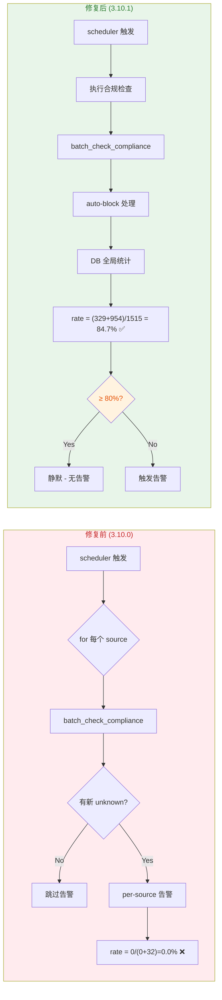

# v3.10.1 发布计划：CLI 工具修复与合规率告警修正

> 生成日期：2026-08-06
> 状态：待审核

***

## 一、变更分析

### 1.1 变更总览

| 维度       | 内容                   |
| -------- | -------------------- |
| **当前版本** | 3.10.0               |
| **目标版本** | 3.10.1（Patch：Bug 修复） |
| **分支**   | develop              |
| **修改文件** | 10 个文件               |
| **变更统计** | +307 / -98 行         |

### 1.2 变更分类

| 分类              | 说明                                                                                     | 涉及文件                                                                         |
| --------------- | -------------------------------------------------------------------------------------- | ---------------------------------------------------------------------------- |
| **CLI 工具修复**    | 修复 `user list/unlock`、`role list` 命令的属性错误；修复 `scheduler trigger compliance_check` 参数缺失 | `backend/cli.py`                                                             |
| **合规率告警修正**     | 修正计算公式、删除重复告警、新增 DB 全局统计告警、添加阈值守卫                                                      | `backend/app/main.py`                                                        |
| **告警增强**        | `emit_compliance_alert` 扩展参数、阈值守卫、告警数据增强                                               | `backend/app/services/event_emitter.py`                                      |
| **Shell 脚本健壮性** | `manage.sh` 修复 `$2` 未绑定变量、重写版本管理命令、新增 `CLI_API_BASE_URL` 支持                            | `manage.sh`, `.env.example`                                                  |
| **前端 i18n**     | 合规设置区域参数描述国际化                                                                          | `frontend/src/pages/GeneralSettings.tsx`                                     |
| **版本管理**        | Dockerfile 自动同步 package.json 版本；package.json 版本更新                                      | `frontend/Dockerfile`, `frontend/package.json`, `frontend/package-lock.json` |
| **版本格式**        | VERSION 文件格式修正                                                                         | `VERSION`                                                                    |

### 1.3 详细变更清单

#### CLI 工具修复（`backend/cli.py`）

| 命令                                   | 原问题                                                | 修复方案                                                                            |
| ------------------------------------ | -------------------------------------------------- | ------------------------------------------------------------------------------- |
| `user list`                          | `u.locked_until` 属性不存在，账户锁定状态存储在 Redis             | 批量查询 Redis `login_lock:{username}` 的 TTL                                        |
| `user unlock`                        | 修改不存在的 `failed_login_attempts` 和 `locked_until` 字段 | 调用 `reset_login_attempts()` 清除 Redis key                                        |
| `role list`                          | `r.is_builtin`、`r.display_name` 属性不存在              | 改为 `r.is_default`、`r.name`                                                      |
| `scheduler trigger compliance_check` | `batch_check_compliance()` 缺少 `entries` 参数         | 完整实现 compliance\_check 流程：查找 ARP 数据源→遍历 unchecked→批量 check→应用结果→auto-block→全局告警 |

#### 合规率告警修正（`backend/app/main.py`）

| 问题      | 原代码                                                                                  | 修正后                                                                                              |
| ------- | ------------------------------------------------------------------------------------ | ------------------------------------------------------------------------------------------------ |
| 公式错误    | `total = compliant + non_compliant`；`rate = compliant / total`（bypass 和 unknown 被排除） | `checked = compliant + bypass + non_compliant + unknown`；`rate = (compliant + bypass) / checked` |
| 重复告警    | for 循环内部和外部各有一处 `emit_compliance_alert`                                              | 删除 for 循环内部告警，仅保留 DB 全局统计告警                                                                      |
| 告警数据源错误 | 使用 per-source 本次检查结果（可能只有 32 个新终端）                                                   | 使用 `TerminalService.get_stats()` 读取 DB 全局统计（1515 个终端）                                            |

**修正前后对比**：



#### 告警增强（`backend/app/services/event_emitter.py`）

| 新增   | 说明                                                             |
| ---- | -------------------------------------------------------------- |
| 扩展参数 | `compliant_count`, `bypass_count`, `total_checked`（默认 0，向后兼容）  |
| 阈值守卫 | `if compliance_rate >= threshold: return []` — 超阈值不发告警         |
| 数据增强 | 告警事件数据包含 `total_checked`、`compliant_count`、`bypass_count` 便于排障 |

#### Shell 脚本修复（`manage.sh`）

| 修复                   | 说明                                                                           |
| -------------------- | ---------------------------------------------------------------------------- |
| `$2` → `${2:-}`      | 4 处未绑定变量错误修复（`cmd_version_bump`、`save_state`、`set_env`、`interactive_backup`） |
| `version bump` 重写    | 仅同步必要文件：VERSION → package.json；删除冗余文件同步                                      |
| `version check` 重写   | 仅检查必要文件一致性                                                                   |
| `_API_BASE_URL` 改为函数 | 默认 `http://localhost:8080/api/v1`，支持 `.env` 中 `CLI_API_BASE_URL` 覆盖          |

#### 前端修复（`frontend/Dockerfile`、`GeneralSettings.tsx`）

| 修复        | 说明                                                     |
| --------- | ------------------------------------------------------ |
| 版本自动同步    | Dockerfile 在 `npm ci` 前用 sed 同步 VERSION → package.json |
| 参数描述 i18n | 合规设置区域 5 个配置项描述使用 `FIELD_DESC_I18N_KEYS` 映射表           |

### 1.4 验证结果

| 验证项                                              | 结果                                                 |
| ------------------------------------------------ | -------------------------------------------------- |
| `./manage.sh user list`                          | ✅ 正常显示 5 个用户，锁定状态从 Redis 查询                        |
| `./manage.sh role list`                          | ✅ 正常显示 5 个角色，字段名正确                                 |
| `./manage.sh scheduler trigger compliance_check` | ✅ 显示 DB 全局统计，合规率 84.7%                             |
| 合规率公式                                            | ✅ `(329+954)/1515 = 84.7%` 正确                      |
| 阈值守卫                                             | ✅ 84.7% ≥ 80% 时静默，不发告警                             |
| 告警数据增强                                           | ✅ 包含 total\_checked、compliant\_count、bypass\_count |

***

## 二、发布步骤

### 步骤 1：版本升级（3.10.0 → 3.10.1）

| 文件                           | 操作                               | 说明              |
| ---------------------------- | -------------------------------- | --------------- |
| `VERSION`                    | 编辑为 `3.10.1`                     | 单一真相源           |
| `frontend/package.json`      | 运行 `manage.sh version bump` 自动同步 | 从 VERSION 读取    |
| `frontend/package-lock.json` | 运行 `npm install` 自动更新            | 跟随 package.json |
| `frontend/Dockerfile`        | 无需修改（已配置自动同步）                    | 构建时从 VERSION 读取 |

### 步骤 2：文档更新

| 文档                      | 操作                               | 说明                     |
| ----------------------- | -------------------------------- | ---------------------- |
| `docs/changelog.md`     | 新增 `[3.10.1] - 2026-08-06` 版本块   | 遵循 Keep a Changelog 格式 |
| `docs/release-notes.md` | 新增 `[v3.10.1] - 2026-08-06` 发布记录 | 包含变更分类、根因分析、修复内容       |
| 文档头部版本号                 | 更新为 `v3.10.1`                    | 所有文档的版本头部              |

### 步骤 3：代码提交

```bash
# 3.1 添加所有变更到暂存区
git add -A

# 3.2 提交（使用 Conventional Commits 规范）
git commit -m "fix: CLI tool errors and compliance alert formula (v3.10.1)

- fix(cli.py): replace u.locked_until with Redis lock query in _list_users
- fix(cli.py): use reset_login_attempts() instead of removing locked_until field
- fix(cli.py): r.is_builtin -> r.is_default, r.display_name -> r.name in _list_roles
- fix(cli.py): implement compliance_check trigger with proper entries parameter
- fix(main.py): correct compliance rate formula - include bypass+unknown in denominator
- fix(main.py): remove duplicate per-source alert, use global DB stats only
- fix(event_emitter.py): add threshold guard, extended data fields
- fix(manage.sh): ${2:-} for unbound variable errors in 4 functions
- fix(manage.sh): rewrite version bump/check to sync only necessary files
- fix(manage.sh): _API_BASE_URL as function, support CLI_API_BASE_URL override
- fix(GeneralSettings.tsx): add FIELD_DESC_I18N_KEYS for compliance settings
- fix(Dockerfile): add sed command to sync VERSION -> package.json"
```

### 步骤 4：推送到远程仓库

```bash
# 推送到 develop 分支
git push origin develop
```

### 步骤 5：创建 Pull Request

使用 GitHub CLI 手动创建 PR：

```bash
# 5.1 确保在 develop 分支
git checkout develop

# 5.2 基于 develop 创建 PR 到 main
gh pr create \
  --title "fix: CLI tool errors and compliance alert formula (v3.10.1)" \
  --body @.trae/documents/pr_body.md \
  --base main \
  --head develop \
  --label bugfix
```

**PR 标题建议**：

> fix: CLI 工具属性错误修复与合规率告警公式修正 (v3.10.1)

**PR 描述要点**：

* **问题**：`user list/unlock`、`role list` 命令报 `AttributeError`；合规率告警显示 `0.0%` 或 `nan`

* **根因**：User/Role 模型字段名变更、锁定状态迁移至 Redis、合规率计算公式错误、告警数据源错误

* **修复**：10 个文件、+307/-98 行，详见 changelog 和 release-notes

* **验证**：3 项 CLI 命令测试通过、合规率公式验证正确、阈值守卫正常工作

* **影响范围**：仅限 CLI 工具和调度器告警逻辑，不影响核心 API 接口

### 步骤 6：打 Tag

```bash
# 6.1 在本地创建 tag
git tag -a v3.10.1 -m "Release v3.10.1: CLI tool fixes and compliance alert correction"

# 6.2 推送 tag 到远程
git push origin v3.10.1
```

***

## 三、风险评估

| 风险项        | 等级 | 缓解措施                                             |
| ---------- | -- | ------------------------------------------------ |
| 合规率告警逻辑变更  | 低  | 已验证公式正确性；阈值守卫确保合规率达标时不告警                         |
| CLI 工具行为变更 | 低  | 仅修复错误行为，不引入新功能；向后兼容                              |
| 版本同步流程     | 低  | Dockerfile 已配置自动同步；`manage.sh version bump` 手动同步 |
| 文档与代码不一致   | 低  | 按步骤顺序执行；`manage.sh version check` 可验证一致性         |

***

## 四、后续行动

* [ ] 执行版本升级（步骤 1）

* [ ] 更新文档（步骤 2）

* [ ] 代码提交（步骤 3）

* [ ] 推送远程（步骤 4）

* [ ] 创建 PR 并审核（步骤 5）

* [ ] 合并 PR 到 main 并打 Tag（步骤 6）

* [ ] 在生产环境重建 backend 容器（`./manage.sh rebuild backend`）

* [ ] 最终验证：生产环境 `user list`、`role list`、`compliance_check`

***

## 附录：Conventional Commits 规范

| 前缀          | 说明     | 本次使用 |
| ----------- | ------ | ---- |
| `fix:`      | Bug 修复 | ✅    |
| `feat:`     | 新功能    | —    |
| `docs:`     | 文档更新   | —    |
| `refactor:` | 重构     | —    |
| `chore:`    | 杂项     | —    |

