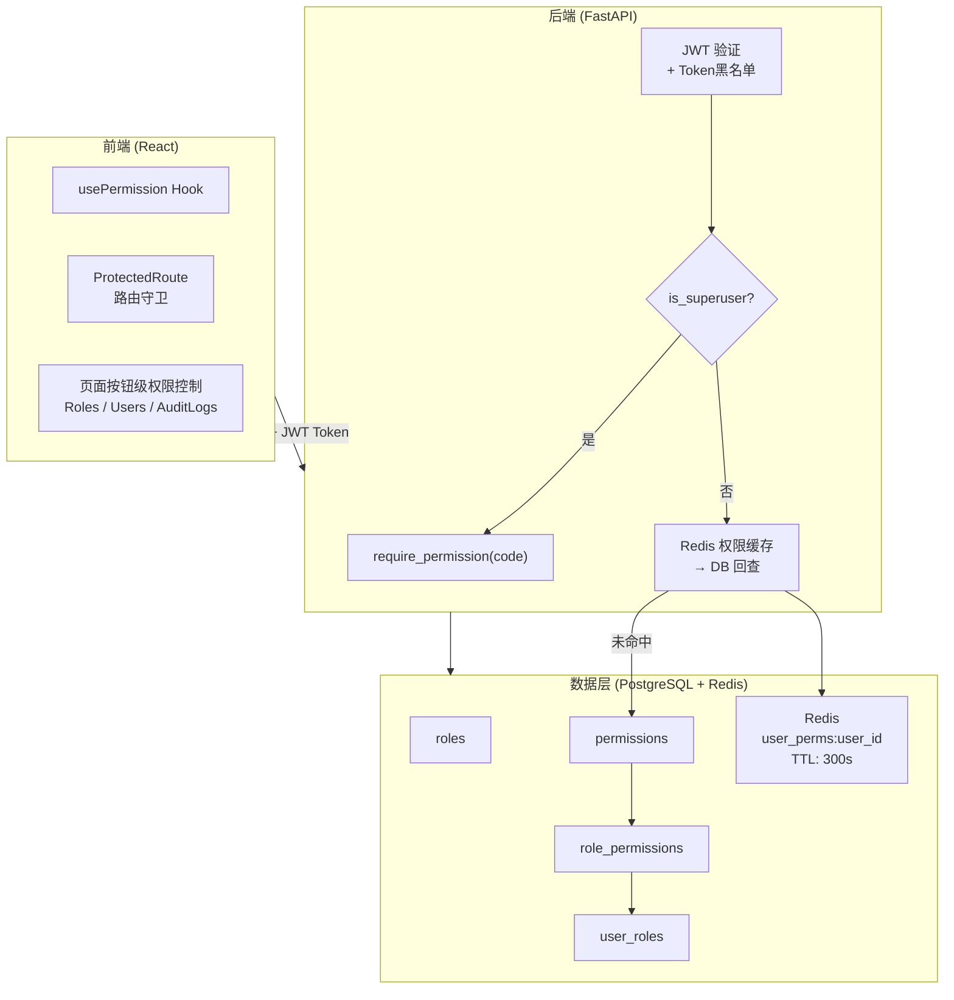
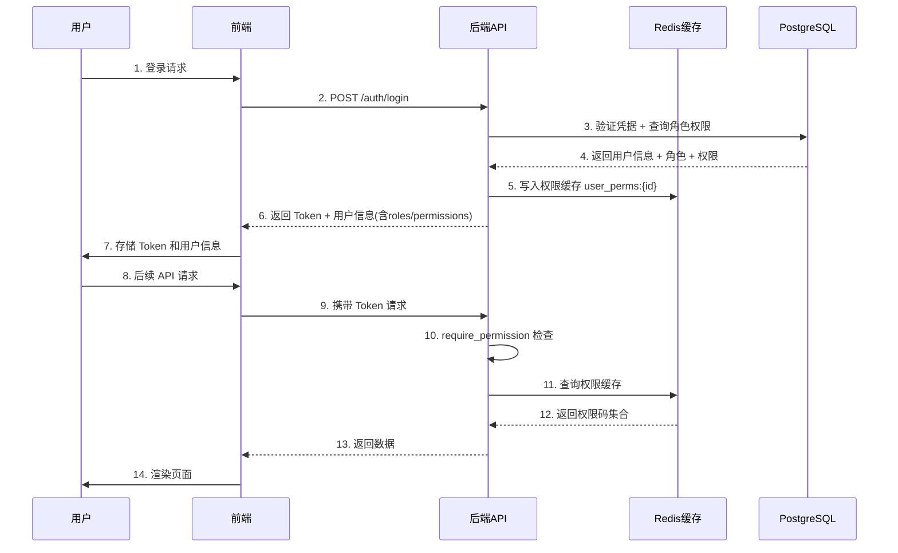
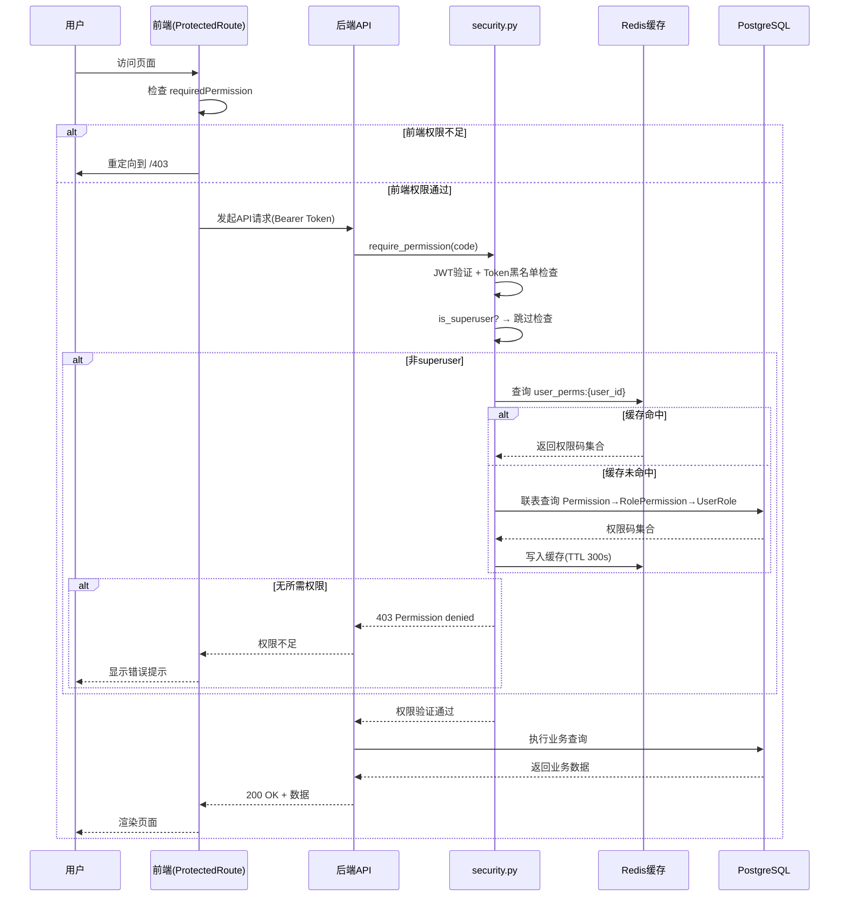
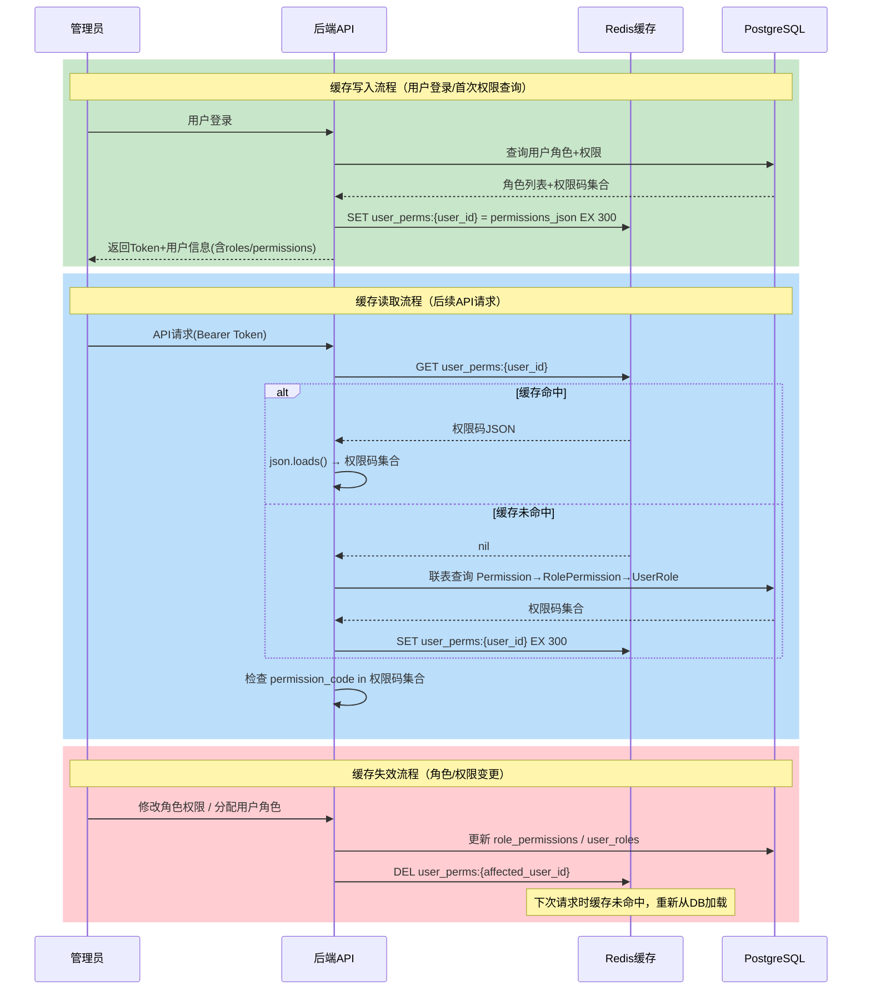
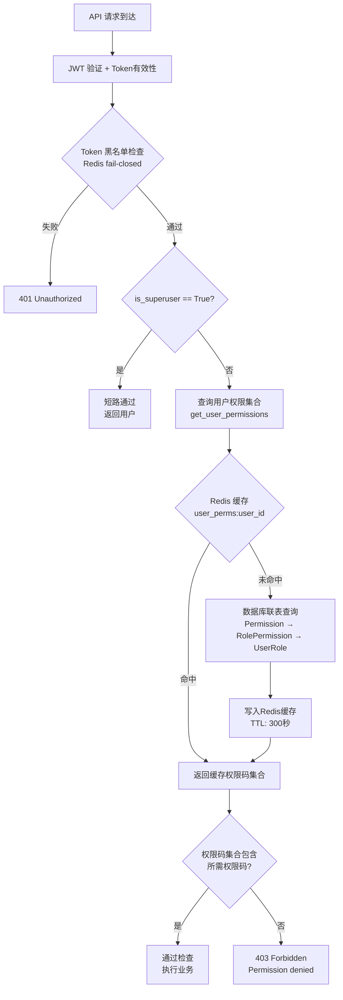
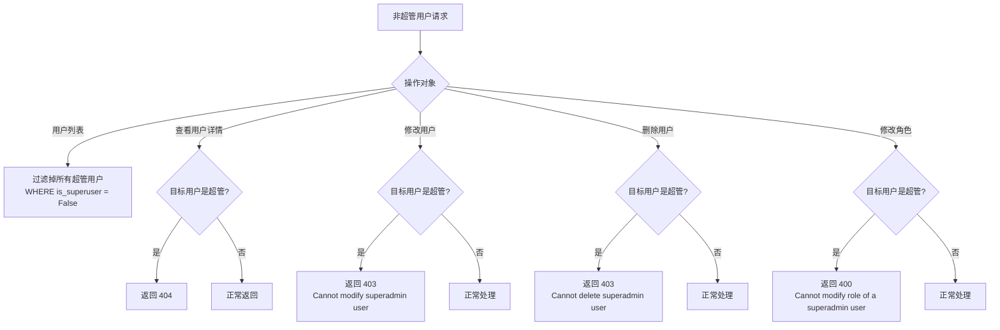

# RBAC 角色管理与用户访问控制

**版本**: v3.2.0-r10
**更新日期**: 2026-06-16  
**变更说明**: 黑名单管理移除手动添加功能（改为审计视图）；终端操作按钮矩阵重构

---

## 目录

1. [概述](#1-概述)
2. [角色体系](#2-角色体系)
3. [认证机制](#3-认证机制)
4. [权限控制架构](#4-权限控制架构)
5. [API端点权限矩阵](#5-api端点权限矩阵)
6. [前端权限控制](#6-前端权限控制)
7. [安全防护机制](#7-安全防护机制)
8. [角色管理操作指南](#8-角色管理操作指南)
9. [审计与追踪](#9-审计与追踪)
10. [安全配置参考](#10-安全配置参考)
11. [RBAC改造实施记录](#11-rbac改造实施记录)
12. [后期优化建议](#12-后期优化建议)

---

## 1. 概述

### 1.1 系统简介

本系统采用基于角色的访问控制（RBAC, Role-Based Access Control）模型，实现细粒度的权限管理。系统通过角色（Role）将权限（Permission）与用户（User）关联，每个用户分配单一角色，支持自定义角色创建，满足不同业务场景下的权限隔离需求。

### 1.2 核心设计原则

- **最小权限原则**: 用户仅被授予完成工作所需的最低权限
- **职责分离**: 不同角色拥有不同模块的操作权限，避免权限集中
- **超管豁免**: superadmin 角色在代码层面跳过权限检查，确保系统可管理性
- **超管隔离**: 超管用户对非超管用户不可见、不可管理，超管只能自己管理自己
- **单角色约束**: 每个用户仅能分配一个角色，避免权限叠加导致职责模糊
- **前后端双重校验**: 前端做 UI 展示控制，后端做真正的权限边界校验
- **缓存加速**: 权限数据通过 Redis 缓存，减少数据库查询压力

### 1.3 系统架构



---

## 2. 角色体系

### 2.1 数据模型

系统通过4张核心表实现 RBAC 数据模型：

| 表名 | 说明 | 关键字段 |
|------|------|----------|
| `roles` | 角色定义 | id, name(unique), description, is_default, created_at, updated_at |
| `permissions` | 权限定义 | id, code(unique), name, module, description |
| `user_roles` | 用户-角色关联 | user_id(FK→users.id), role_id(FK→roles.id)，复合主键 |
| `role_permissions` | 角色-权限关联 | role_id(FK→roles.id), permission_id(FK→permissions.id)，复合主键 |

关联关系：
- 用户 → 角色：单角色分配（通过 `user_roles`，业务层限制每用户仅一条记录）
- 角色 ←→ 权限：多对多（通过 `role_permissions`）
- 外键均设置 `ON DELETE CASCADE`，删除角色时自动清理关联数据

> **设计说明**: `user_roles` 表保留了多对多的表结构，但业务层强制单角色约束——创建用户时传入 `role_id: int`（单值），更新用户时同样为单值。前端使用 select 下拉框（单选）而非 checkbox 多选。

### 2.2 预设角色

系统内置5个预设角色，不可删除：

| 角色 | 标识名 | 描述 | 是否默认 | 权限范围 |
|------|--------|------|----------|----------|
| 超级管理员 | `superadmin` | 拥有系统全部权限，不可分配、不可修改 | 否 | 代码层面跳过权限检查，无需分配权限记录 |
| 管理员 | `admin` | 管理用户、数据源、系统配置 | 否 | 23个权限码（除 terminal:read/write、whitelist:read/write、blacklist:read/write） |
| 操作员 | `operator` | 操作终端、白名单、黑名单 | **是** | 10个权限码（终端读写 + 白名单读写 + 黑名单读写 + 数据源读取 + 基线读取 + 审计读取 + 统计读取） |
| 审计员 | `auditor` | 查看审计日志和导出 | 否 | 8个权限码（终端/白名单/黑名单/数据源/基线读取 + 审计读取导出 + 统计读取） |
| 只读用户 | `viewer` | 仅查看各模块数据 | 否 | 10个权限码（终端/白名单/黑名单/数据源/基线/用户/审计/配置/统计/角色 读取） |

**默认角色说明**: 当通过管理员创建用户且未指定 `role_id` 时，自动分配 `operator` 角色（is_default=True）；当通过公开注册创建用户时，自动分配 `is_default=True` 的角色（即 `operator`）。

### 2.3 自定义角色

管理员可创建自定义角色，灵活组合权限码。自定义角色可编辑和删除，但内置角色（superadmin/admin/operator/auditor/viewer）不可删除，superadmin 角色不可修改。

**角色保护规则**:

| 规则 | 说明 |
|------|------|
| 内置角色不可删除 | superadmin/admin/operator/auditor/viewer 5个角色不可删除 |
| superadmin 角色不可修改 | 不可编辑描述、不可调整权限 |
| superadmin 角色不可分配 | 创建/编辑用户时角色下拉框过滤掉 superadmin |
| 有用户的角色不可删除 | 需先移除用户关联后才能删除 |
| 自定义角色可编辑 | 可修改描述和权限分配 |

### 2.4 权限码定义

系统共定义29个权限码，按10个功能模块分组：

#### 终端管理 (terminal)

| 权限码 | 名称 | 描述 |
|--------|------|------|
| `terminal:read` | 查看终端 | 查看终端列表和详情 |
| `terminal:write` | 操作终端 | 封禁/解封终端 |

> **终端状态枚举（v3.2.0-r4）：** 终端 `status` 字段仅包含 `blocked`（已封堵）和 `unblocked`（未封堵）两个值。`terminal:write` 权限控制封禁（blocked）和解封（unblocked）操作，合规状态由 `compliance_status` 字段独立追踪。

#### 白名单管理 (whitelist)

| 权限码 | 名称 | 描述 |
|--------|------|------|
| `whitelist:read` | 查看白名单 | 查看白名单列表 |
| `whitelist:write` | 管理白名单 | 添加/删除白名单条目 |

#### 黑名单管理 (blacklist)

| 权限码 | 名称 | 描述 |
|--------|------|------|
| `blacklist:read` | 查看封禁列表 | 查看封禁列表 |
| `blacklist:write` | 管理封禁列表 | 添加/解封黑名单条目 |

#### 数据源管理 (datasource)

| 权限码 | 名称 | 描述 |
|--------|------|------|
| `datasource:read` | 查看数据源 | 查看数据源列表和详情 |
| `datasource:write` | 管理数据源 | 创建/编辑/删除数据源和绑定 |
| `datasource:test` | 测试数据源 | 测试数据源连接 |
| `datasource:sync` | 同步数据源 | 手动同步数据源 |
| `datasource:compliance` | 合规检查 | 执行合规检查和自动封禁 |

#### 合规基线管理 (baseline)

| 权限码 | 名称 | 描述 |
|--------|------|------|
| `baseline:read` | 查看合规基线 | 查看合规基线列表 |
| `baseline:write` | 管理合规基线 | 创建/编辑/删除合规基线 |
| `baseline:test` | 测试合规基线 | 测试合规基线连接 |
| `baseline:sync` | 同步合规基线 | 手动同步合规基线 |

#### 用户管理 (user)

| 权限码 | 名称 | 描述 |
|--------|------|------|
| `user:read` | 查看用户 | 查看用户列表和详情 |
| `user:write` | 管理用户 | 创建/编辑用户 |
| `user:delete` | 删除用户 | 删除用户 |
| `user:password` | 重置密码 | 重置用户密码 |
| `user:unlock` | 解锁用户 | 解锁用户账户 |

#### 审计管理 (audit)

| 权限码 | 名称 | 描述 |
|--------|------|------|
| `audit:read` | 查看审计日志 | 查看审计日志 |
| `audit:export` | 导出审计日志 | 导出审计日志为CSV |

#### 系统配置 (settings)

| 权限码 | 名称 | 描述 |
|--------|------|------|
| `settings:read` | 查看系统配置 | 查看系统配置 |
| `settings:write` | 修改系统配置 | 修改系统配置 |
| `settings:upload` | 上传品牌资源 | 上传登录背景和图标 |

#### 统计 (stats)

| 权限码 | 名称 | 描述 |
|--------|------|------|
| `stats:read` | 查看统计 | 查看仪表盘统计 |

#### 角色管理 (role)

| 权限码 | 名称 | 描述 |
|--------|------|------|
| `role:read` | 查看角色 | 查看角色列表和权限 |
| `role:write` | 管理角色 | 创建/编辑角色和分配权限 |
| `role:delete` | 删除角色 | 删除角色 |

### 2.5 角色-权限对应矩阵

| 权限码 | superadmin | admin | operator | auditor | viewer |
|--------|:----------:|:-----:|:--------:|:-------:|:------:|
| terminal:read | ★ | | ✓ | ✓ | ✓ |
| terminal:write | ★ | | ✓ | | |
| whitelist:read | ★ | | ✓ | ✓ | ✓ |
| whitelist:write | ★ | | ✓ | | |
| blacklist:read | ★ | | ✓ | ✓ | ✓ |
| blacklist:write | ★ | | ✓ | | |
| datasource:read | ★ | ✓ | ✓ | ✓ | ✓ |
| datasource:write | ★ | ✓ | | | |
| datasource:test | ★ | ✓ | | | |
| datasource:sync | ★ | ✓ | | | |
| datasource:compliance | ★ | ✓ | | | |
| baseline:read | ★ | ✓ | ✓ | ✓ | ✓ |
| baseline:write | ★ | ✓ | | | |
| baseline:test | ★ | ✓ | | | |
| baseline:sync | ★ | ✓ | | | |
| user:read | ★ | ✓ | | | ✓ |
| user:write | ★ | ✓ | | | |
| user:delete | ★ | ✓ | | | |
| user:password | ★ | ✓ | | | |
| user:unlock | ★ | ✓ | | | |
| audit:read | ★ | ✓ | ✓ | ✓ | ✓ |
| audit:export | ★ | ✓ | | ✓ | |
| settings:read | ★ | ✓ | | | ✓ |
| settings:write | ★ | ✓ | | | |
| settings:upload | ★ | ✓ | | | |
| stats:read | ★ | ✓ | ✓ | ✓ | ✓ |
| role:read | ★ | ✓ | | | ✓ |
| role:write | ★ | ✓ | | | |
| role:delete | ★ | ✓ | | | |

> ★ = 代码层面跳过权限检查（is_superuser=True），✓ = 通过 role_permissions 表分配

**权限数量统计**:

| 角色 | 权限数 | 说明 |
|------|--------|------|
| superadmin | 29（代码短路） | 不依赖 role_permissions 表记录 |
| admin | 23 | 管理类权限，不含终端/白名单/黑名单操作 |
| operator | 10 | 终端操作类权限 + 各模块读取 |
| auditor | 8 | 各模块读取 + 审计导出 |
| viewer | 10 | 各模块读取权限 |

---

## 3. 认证机制

### 3.1 JWT 双令牌认证

系统采用 JWT（JSON Web Token）双令牌机制：

| 令牌类型 | 有效期 | 存储位置 | 用途 |
|----------|--------|----------|------|
| Access Token | 30分钟 | sessionStorage | API 请求认证 |
| Refresh Token | 7天 | sessionStorage | 无感刷新 Access Token |

### 3.2 令牌安全机制

- **令牌黑名单**: 用户登出时将 Token 加入 Redis 黑名单，防止已注销令牌被复用
- **令牌版本控制**: Redis 维护 `token_version:{user_id}`，密码修改或账户锁定时递增版本号，使旧令牌失效
- **Redis 故障策略**: Token 黑名单检查采用 fail-closed 策略，Redis 不可用时拒绝请求，防止已注销令牌绕过检查

### 3.3 认证与权限获取流程



### 3.4 用户注册默认角色

- **管理员创建用户**: 未指定 `role_id` 时自动分配 `operator` 角色（is_default=True）
- **公开注册用户**: 自动分配 `is_default=True` 的角色（当前为 `operator`）
- **超管用户**: `is_superuser=True` 时自动分配 `superadmin` 角色
- **角色分配约束**: 创建/编辑用户时，角色下拉框过滤掉 `superadmin`，不可将超管角色分配给任何用户

---

## 4. 权限控制架构

### 4.1 后端权限检查机制

后端通过 FastAPI 依赖注入实现权限控制，核心组件为 `require_permission` 工厂函数：

```python
# app/core/security.py
def require_permission(permission_code: str):
    """权限检查依赖工厂函数"""
    async def permission_checker(
        current_user: User = Depends(get_current_user),
        db: AsyncSession = Depends(get_db)
    ) -> User:
        # 1. superuser 短路：直接通过
        if current_user.is_superuser:
            return current_user
        # 2. 获取用户权限集合
        permissions = await get_user_permissions(db, current_user.id)
        # 3. 检查是否包含所需权限码
        if permission_code not in permissions:
            raise HTTPException(status_code=403, detail=f"Permission denied: {permission_code}")
        return current_user
    return permission_checker
```

### 4.2 权限检查数据流图



### 4.3 权限缓存数据流图



### 4.4 后端权限检查逻辑流程图



### 4.5 权限缓存机制

| 项目 | 说明 |
|------|------|
| 缓存键 | `user_perms:{user_id}` |
| 缓存值 | 权限码集合（JSON序列化） |
| TTL | 300秒（5分钟） |
| 写入时机 | 首次查询时从数据库加载并写入 |
| 失效时机 | 角色权限变更、用户角色分配/变更时主动删除 |

**缓存失效触发点**:
- `update_role` — 修改角色权限后，失效该角色关联的所有用户缓存
- `assign_user_roles` — 分配用户角色后，失效该用户缓存
- `admin_update_user` — 更新用户角色后，失效该用户缓存
- `admin_create_user` — 创建用户后，预热缓存

### 4.6 superadmin 角色与 is_superuser 字段

当前系统中 `is_superuser` 字段与 RBAC 角色体系并存：

- `is_superuser=True` 的用户自动拥有 `superadmin` 角色
- `require_permission` 中 `is_superuser=True` 直接通过，不查数据库
- 角色分配时自动同步 `is_superuser` 字段（拥有 superadmin 角色 → `is_superuser=True`，否则 → `False`）
- superadmin 角色 ID 通过动态查询 `Role.name == "superadmin"` 获取，不硬编码

---

## 5. API端点权限矩阵

### 5.1 认证端点 (auth)

| 端点 | 方法 | 所需权限 | 说明 |
|------|------|----------|------|
| `/auth/login` | POST | 无（公开） | 用户登录 |
| `/auth/captcha` | GET | 无（公开） | 获取验证码 |
| `/auth/register` | POST | 无（公开） | 用户注册（受配置开关控制） |
| `/auth/me` | GET | 登录即可 | 获取当前用户信息（含roles/permissions） |
| `/auth/refresh` | POST | Token自验证 | 刷新Access Token |
| `/auth/logout` | POST | 登录即可 | 用户登出 |
| `/auth/me/profile` | PUT | 登录即可 | 更新个人资料 |
| `/auth/me/password` | PUT | 登录即可 | 修改个人密码 |
| `/auth/users` | GET | `user:read` | 获取用户列表（非超管看不到超管用户） |
| `/auth/users` | POST | `user:write` | 管理员创建用户（不可分配superadmin角色） |
| `/auth/users/{id}` | GET | `user:read` | 获取用户详情（非超管查看超管返回404） |
| `/auth/users/{id}` | PUT | `user:write` | 管理员更新用户（超管角色不可变更） |
| `/auth/users/{id}` | DELETE | `user:delete` | 删除用户（不可删除超管/自己/初始管理员） |
| `/auth/users/{id}/password` | PUT | `user:password` | 重置用户密码 |
| `/auth/users/{id}/unlock` | POST | `user:unlock` | 解锁用户账户 |

### 5.2 角色管理端点 (roles)

| 端点 | 方法 | 所需权限 | 说明 |
|------|------|----------|------|
| `/roles/` | GET | `role:read` | 获取角色列表 |
| `/roles/permissions` | GET | `role:read` | 获取权限码列表 |
| `/roles/{id}` | GET | `role:read` | 获取角色详情（非超管不可查看superadmin详情） |
| `/roles/` | POST | `role:write` | 创建角色 |
| `/roles/{id}` | PUT | `role:write` | 更新角色（含权限分配，superadmin不可修改） |
| `/roles/{id}` | DELETE | `role:delete` | 删除角色（内置角色不可删除，有用户的角色不可删除） |
| `/roles/users/{id}/roles` | PUT | `user:write` | 分配用户角色（单角色，不可分配superadmin） |
| `/roles/{id}/users` | GET | `role:read` | 获取角色下的用户列表（非超管不可查看superadmin用户） |

### 5.3 终端管理端点 (terminals)

| 端点 | 方法 | 所需权限 | 说明 |
|------|------|----------|------|
| `/terminals/` | GET | `terminal:read` | 获取终端列表 |
| `/terminals/search` | GET | `terminal:read` | 搜索终端 |
| `/terminals/block/{ip}` | POST | `terminal:write` | 封禁IP |
| `/terminals/unblock/{ip}` | POST | `terminal:write` | 解封IP |
| `/terminals/{id}` | GET | `terminal:read` | 获取终端详情 |

### 5.4 白名单端点 (whitelist)

| 端点 | 方法 | 所需权限 | 说明 |
|------|------|----------|------|
| `/whitelist/` | GET | `whitelist:read` | 获取白名单列表 |
| `/whitelist/` | POST | `whitelist:write` | 添加白名单 |
| `/whitelist/{id}` | DELETE | `whitelist:write` | 删除白名单 |

### 5.5 黑名单端点 (blacklist)

| 端点 | 方法 | 所需权限 | 说明 |
|------|------|----------|------|
| `/blacklist/` | GET | `blacklist:read` | 获取黑名单列表 |
| `/blacklist/` | POST | `blacklist:write` | 添加黑名单 |
| `/blacklist/{id}` | DELETE | `blacklist:write` | 删除黑名单 |

### 5.6 统计端点 (stats)

| 端点 | 方法 | 所需权限 | 说明 |
|------|------|----------|------|
| `/stats/` | GET | `stats:read` | 获取仪表盘统计 |
| `/stats/system-status` | GET | `stats:read` | 获取系统状态 |

### 5.7 审计日志端点 (logs)

| 端点 | 方法 | 所需权限 | 说明 |
|------|------|----------|------|
| `/logs/` | GET | `audit:read` | 获取审计日志 |
| `/logs/search` | GET | `audit:read` | 搜索审计日志 |
| `/logs/export` | GET | `audit:export` | 导出审计日志 |

### 5.8 数据源端点 (data-sources)

| 端点 | 方法 | 所需权限 | 说明 |
|------|------|----------|------|
| `/data-sources/` | GET | `datasource:read` | 获取数据源列表 |
| `/data-sources/` | POST | `datasource:write` | 创建数据源 |
| `/data-sources/{id}` | GET | `datasource:read` | 获取数据源详情 |
| `/data-sources/{id}` | PUT | `datasource:write` | 更新数据源 |
| `/data-sources/{id}` | DELETE | `datasource:write` | 删除数据源 |
| `/data-sources/{id}/test` | POST | `datasource:test` | 测试连接 |
| `/data-sources/{id}/sync` | POST | `datasource:sync` | 同步数据源 |
| `/data-sources/bindings/` | GET | `datasource:read` | 获取绑定列表 |
| `/data-sources/bindings/` | POST | `datasource:write` | 创建绑定 |
| `/data-sources/bindings/{id}` | DELETE | `datasource:write` | 删除绑定 |
| `/data-sources/compliance/check` | POST | `datasource:compliance` | 合规检查 |
| `/data-sources/compliance/auto-block` | POST | `datasource:compliance` | 自动封禁 |
| `/data-sources/compliance/auto-unblock` | POST | `datasource:compliance` | 自动解封 |

### 5.9 系统配置端点 (settings)

| 端点 | 方法 | 所需权限 | 说明 |
|------|------|----------|------|
| `/settings/branding` | GET | 无（公开） | 获取品牌配置 |
| `/settings/` | GET | `settings:read` | 获取全部配置 |
| `/settings/list` | GET | `settings:read` | 列出配置项 |
| `/settings/update` | PUT | `settings:write` | 批量更新配置 |
| `/settings/{key}` | PUT | `settings:write` | 更新单个配置 |
| `/settings/seed` | POST | `settings:write` | 初始化默认配置 |
| `/settings/invalidate-cache` | POST | `settings:write` | 失效配置缓存 |
| `/settings/upload` | POST | `settings:upload` | 上传品牌资源 |

### 5.10 合规基线端点 (compliance-baselines)

| 端点 | 方法 | 所需权限 | 说明 |
|------|------|----------|------|
| `/compliance-baselines/` | GET | `baseline:read` | 获取基线列表 |
| `/compliance-baselines/` | POST | `baseline:write` | 创建基线 |
| `/compliance-baselines/{id}` | GET | `baseline:read` | 获取基线详情 |
| `/compliance-baselines/{id}` | PUT | `baseline:write` | 更新基线 |
| `/compliance-baselines/{id}` | DELETE | `baseline:write` | 删除基线 |
| `/compliance-baselines/{id}/test` | POST | `baseline:test` | 测试连接 |
| `/compliance-baselines/{id}/sync` | POST | `baseline:sync` | 同步基线 |

---

## 6. 前端权限控制

### 6.1 前端权限检查流程图

```mermaid
flowchart TD
    A[用户访问页面] --> B[路由守卫<br/>ProtectedRoute]
    B --> C{已登录?}
    C -->|否| D[重定向 /login]
    C -->|是| E{requiredPermission?}
    E -->|无| F[直接放行]
    E -->|有| G{权限检查<br/>is_superuser ||<br/>permissions.includes}
    G -->|通过| H[渲染页面]
    G -->|不通过| I[重定向 /403]
    H --> J[页面内按钮级权限控制]
    J --> K{hasPermission?}
    K -->|是| L[显示操作按钮]
    K -->|否| M[隐藏/禁用按钮]
```

### 6.2 usePermission Hook

前端通过 `usePermission` Hook 统一权限判断逻辑：

```typescript
// src/hooks/usePermission.ts
const { hasPermission, hasAnyPermission, hasAllPermissions, hasRole } = usePermission();
```

| 方法 | 签名 | 说明 |
|------|------|------|
| `hasPermission` | `(code: string): boolean` | 检查是否拥有单个权限码，superuser 直接返回 true |
| `hasAnyPermission` | `(codes: string[]): boolean` | 检查是否拥有任一权限码（OR 逻辑） |
| `hasAllPermissions` | `(codes: string[]): boolean` | 检查是否拥有全部权限码（AND 逻辑） |
| `hasRole` | `(roleName: string): boolean` | 检查是否拥有指定角色 |

### 6.3 路由守卫 (ProtectedRoute)

`ProtectedRoute` 组件在路由层面拦截无权限访问：

| Prop | 类型 | 说明 |
|------|------|------|
| `requireSuperuser` | `boolean?` | 旧版超管检查（向后兼容） |
| `requiredPermission` | `string?` | 单个权限码检查 |
| `requiredAnyPermissions` | `string[]?` | 任一权限码满足即可（OR 逻辑） |

**路由权限配置**:

| 路由 | 所需权限 | 说明 |
|------|----------|------|
| `/dashboard` | 无 | 所有已登录用户可访问 |
| `/terminals` | `terminal:read` | 终端管理 |
| `/whitelist` | `whitelist:read` | 白名单管理 |
| `/blacklist` | `blacklist:read` | 黑名单管理 |
| `/audit-logs` | `audit:read` | 审计日志 |
| `/data-sources` | `datasource:read` | 数据源管理 |
| `/users` | `user:read` | 用户管理 |
| `/roles` | `role:read` | 角色管理 |
| `/profile` | 无 | 个人资料（所有已登录用户） |

### 6.4 侧边栏导航过滤

侧边栏根据 `requiredPermission` 字段过滤导航项：
- 有 `requiredPermission` 的导航项：检查 `is_superuser || permissions.includes(requiredPermission)`
- 仅有 `adminOnly` 的导航项：检查 `is_superuser`
- 无权限要求的导航项：所有已登录用户可见

### 6.5 按钮级权限控制

页面内的操作按钮通过 `usePermission` Hook 进行细粒度权限控制：

**角色管理页面 (Roles)**:
| 按钮 | 所需权限 | 备注 |
|------|----------|------|
| 创建角色 | `role:write` | 条件渲染 |
| 编辑角色 | `role:write` | 条件渲染，superadmin 角色不显示编辑按钮 |
| 删除角色 | `role:delete` | 条件渲染，内置角色不显示删除按钮 |
| 查看权限 | 无权限码 | 仅超管可查看 superadmin 角色的权限 |
| 查看用户 | 无权限码 | 仅超管可查看 superadmin 角色的用户 |

**用户管理页面 (Users)**:
| 按钮 | 所需权限 | 备注 |
|------|----------|------|
| 创建用户 | `user:write` | 条件渲染，角色下拉框过滤 superadmin |
| 编辑用户 | `user:write` | 条件渲染 |
| 删除用户 | `user:delete` | 条件渲染，不可删除自己 |
| 重置密码 | `user:password` | 条件渲染 |
| 解锁账户 | `user:unlock` | 条件渲染 |
| 切换激活状态 | `user:write` | disabled 守卫，不可操作自己 |

**审计日志页面 (AuditLogs)**:
| 按钮 | 所需权限 |
|------|----------|
| 导出日志 | `audit:export` |

**编辑用户弹窗 — 角色字段规则**:

| 编辑对象 | 角色字段显示 | 说明 |
|----------|-------------|------|
| 自己 | 只读文本 + "无法修改自己的角色或状态"提示 | 不可修改角色和激活状态 |
| 超管用户 | 只读文本 + "超管角色不可修改"提示 | 不可修改角色 |
| 其他用户 | select 下拉框（过滤 superadmin） | 可选择角色 |

### 6.6 前端按钮级权限控制差距分析

以下页面的操作按钮**尚未添加前端权限控制**（后端 API 已有权限校验，但前端 UI 层面用户能看到无权操作的按钮，点击后会被后端拒绝）：

| 页面 | 缺失的权限控制 | 受影响按钮 |
|------|---------------|-----------|
| Terminals | `terminal:write` | 封禁/解封/加入白名单/移出白名单 |
| Whitelist | `whitelist:write` | 添加白名单/删除白名单 |
| Blacklist | `blacklist:write` | 封禁终端/解封终端 |
| DataSources | `datasource:write` | 创建/编辑/删除数据源和绑定 |
| DataSources | `datasource:test` | 测试连接 |
| DataSources | `datasource:sync` | 同步数据源 |
| DataSources | `datasource:compliance` | 合规检查/自动封禁/解封 |
| Settings | `settings:write` | 修改配置 |
| Settings | `settings:upload` | 上传品牌资源 |

> **安全说明**: 虽然前端未做按钮级控制，但后端 API 均已通过 `require_permission` 进行权限校验，无权限用户点击按钮后会收到 403 错误。前端按钮级控制仅为 UX 优化，不影响系统安全性。

### 6.7 前端权限控制的局限性

前端权限控制**仅为 UI 展示控制**，不能作为安全边界：
- 用户可通过浏览器开发者工具修改 React 状态
- 用户可直接调用 API 接口绕过前端限制
- **后端 API 的权限校验才是真正的安全边界**

---

## 7. 安全防护机制

### 7.1 账户安全

| 防护项 | 策略 |
|--------|------|
| 密码复杂度 | 至少8位，包含大写字母、小写字母和数字 |
| 登录速率限制 | 10次/分钟（API），5次失败锁定15分钟（可配置） |
| 账户锁定 | 连续5次失败锁定15分钟（可配置，默认15分钟） |
| 验证码 | 连续3次登录失败后要求验证码 |
| 密码修改 | 修改后递增 token_version，使旧令牌失效 |

### 7.2 令牌安全

| 防护项 | 策略 |
|--------|------|
| Token 黑名单 | 登出时加入 Redis 黑名单，检查采用 fail-closed 策略 |
| Token 版本控制 | 密码修改/账户锁定时递增版本号 |
| Redis 故障策略 | Token 黑名单检查 fail-closed（拒绝请求），验证码检查 fail-closed（拒绝验证） |
| 双令牌机制 | Access Token 短期 + Refresh Token 长期 |

### 7.3 输入安全

| 防护项 | 策略 |
|--------|------|
| SQL 注入 | SQLAlchemy ORM 参数化查询 |
| 搜索通配符注入 | LIKE 查询参数转义（`%`、`_`、`\`） |
| XSS 防护 | React JSX 自动转义，未使用 dangerouslySetInnerHTML |
| CSRF | Token 认证机制天然防 CSRF |

### 7.4 权限缓存安全

| 防护项 | 策略 |
|--------|------|
| 缓存失效 | 角色/权限变更时主动删除受影响用户缓存 |
| 缓存 TTL | 300秒自动过期，防止长期使用过期权限 |
| 数据一致性 | 缓存未命中时回查数据库，确保权限数据准确 |

### 7.5 超管隔离机制

超管用户（`is_superuser=True`）与非超管用户之间存在严格的隔离机制，确保超管只能自己管理自己：



| 隔离规则 | 后端实现 | 前端实现 |
|----------|----------|----------|
| 非超管看不到超管用户 | 用户列表 `WHERE is_superuser = False` | 无需额外处理（数据已被过滤） |
| 非超管不能查看超管详情 | `GET /auth/users/{id}` 返回 404 | 无需额外处理 |
| 非超管不能修改超管 | `PUT /auth/users/{id}` 返回 403 | 无需额外处理 |
| 非超管不能删除超管 | `DELETE /auth/users/{id}` 返回 403 | 删除按钮对超管用户不显示 |
| 超管角色不可分配 | 创建/编辑用户时拒绝 superadmin 角色 | 角色下拉框过滤掉 superadmin |
| 超管用户角色不可变更 | `PUT /auth/users/{id}` 检查 `is_superuser` | 编辑超管/自己时角色显示为只读文本 |
| 超管角色详情非超管不可查看 | `GET /roles/{id}` 返回 403 | 仅超管可见超管角色的权限/用户按钮 |

### 7.6 初始管理员保护

系统初始管理员（id=1）拥有4层保护，确保系统始终可管理：

| 保护层 | 后端实现 | 错误信息 |
|--------|----------|----------|
| 不可删除 | `DELETE /auth/users/1` 拒绝 | Cannot delete the initial system administrator |
| 不可降级 | `is_superuser=False` 拒绝 | Cannot demote the initial system administrator |
| 不可停用 | `is_active=False` 拒绝 | Cannot deactivate the initial system administrator |
| 角色不可变更 | `role_id` 变更拒绝 | Cannot modify role of a superadmin user |

---

## 8. 角色管理操作指南

### 8.1 查看角色列表

1. 以拥有 `role:read` 权限的用户登录
2. 在侧边栏点击「角色管理」
3. 查看角色列表，包含角色名称、描述、权限数、用户数
4. 超管角色的权限查看和用户查看按钮仅超管可见

### 8.2 创建自定义角色

1. 以拥有 `role:write` 权限的用户登录
2. 点击「创建角色」按钮
3. 填写角色名称（小写字母开头，仅含小写字母、数字、下划线）和描述
4. 按模块勾选权限（无权限数量限制）
5. 点击保存

### 8.3 编辑角色

1. 以拥有 `role:write` 权限的用户登录
2. 点击角色行的编辑按钮
3. 修改描述或调整权限分配
4. 内置角色名称不可修改，superadmin 角色完全不可修改（不显示编辑按钮）
5. 点击保存

### 8.4 删除角色

1. 以拥有 `role:delete` 权限的用户登录
2. 点击角色行的删除按钮
3. 确认删除操作
4. 内置角色（superadmin/admin/operator/auditor/viewer）不可删除
5. 仍有用户分配的角色不可删除（需先移除用户关联）

### 8.5 为用户分配角色

1. 以拥有 `user:write` 权限的用户登录
2. 进入用户管理页面，编辑目标用户
3. 在角色分配区域选择角色（单选下拉框，不可选择 superadmin）
4. 编辑自己或超管用户时，角色字段为只读显示
5. 保存后用户权限立即生效（缓存自动失效）

### 8.6 典型权限分配场景

| 场景 | 推荐角色 | 说明 |
|------|----------|------|
| 系统管理员 | superadmin | 全部权限，跳过权限检查，仅初始管理员 |
| 运维人员 | admin | 管理用户、数据源、系统配置，不操作终端 |
| 终端操作员 | operator | 操作终端封禁/解封、白名单/黑名单管理 |
| 审计人员 | auditor | 查看和导出审计日志 |
| 只读查看 | viewer | 仅查看各模块数据，不可操作 |
| 自定义需求 | 自定义角色 | 按需组合权限码 |

### 8.7 CLI 运维操作

manage.sh 和 cli.py 提供 CLI 方式的 RBAC 运维操作，适用于无法访问 Web UI 的紧急运维场景（如管理员账户锁定、忘记密码等）。

#### 密码重置

```bash
# 通过 manage.sh（推荐）
./manage.sh password reset <username>              # 自动生成随机密码
./manage.sh password reset <username> --password NewPass123  # 指定新密码

# 通过 cli.py
python cli.py password reset <username>
python cli.py password reset <username> --password NewPass123
```

- 密码必须满足复杂度要求：至少 8 位，包含大写字母、小写字母和数字
- 重置后自动递增 Token 版本号，使该用户所有已登录会话失效
- 同时清除 Redis 中的登录锁定状态

#### 用户管理

```bash
# 列出所有用户
./manage.sh user list
python cli.py user list

# 解锁被锁定的用户账户
./manage.sh user unlock <username>
python cli.py user unlock <username>
```

#### 角色查看

```bash
# 列出所有角色
./manage.sh role list
python cli.py role list

# 列出所有权限码
./manage.sh role permissions
python cli.py role permissions
```

> **重要提示**：当管理员账户被锁定或忘记密码时，CLI 操作是唯一的恢复手段。建议将 `password reset` 和 `user unlock` 命令纳入运维应急手册。

---

## 9. 审计与追踪

### 9.1 审计日志记录范围

系统对以下操作记录审计日志：

| 操作类型 | 审计动作 | 说明 |
|----------|----------|------|
| 用户管理 | create_user | 创建用户 |
| 用户管理 | update_user | 更新用户信息 |
| 用户管理 | delete_user | 删除用户 |
| 用户管理 | role_change | 用户角色变更 |
| 用户管理 | password_reset | 密码重置 |
| 用户管理 | account_unlock | 账户解锁 |
| 角色管理 | create_role | 创建角色 |
| 角色管理 | update_role | 更新角色权限 |
| 角色管理 | delete_role | 删除角色 |
| 角色管理 | assign_roles | 分配用户角色 |
| 认证 | login | 用户登录 |
| 认证 | logout | 用户登出 |
| 终端 | block_terminal | 封禁终端 |
| 终端 | unblock_terminal | 解封终端 |
| 白名单 | whitelist_add | 添加白名单 |
| 白名单 | whitelist_remove | 删除白名单 |
| 黑名单 | blacklist_add | 添加黑名单 |
| 黑名单 | blacklist_remove | 删除黑名单 |

### 9.2 审计日志访问权限

- 查看审计日志：需要 `audit:read` 权限
- 导出审计日志：需要 `audit:export` 权限

---

## 10. 安全配置参考

### 10.1 密码策略配置

| 配置项 | 默认值 | 说明 |
|--------|--------|------|
| 最小长度 | 8 | 密码最少字符数 |
| 大写字母 | 必须 | 至少包含1个大写字母 |
| 小写字母 | 必须 | 至少包含1个小写字母 |
| 数字 | 必须 | 至少包含1个数字 |

> **注意**: 当前密码校验正则为 `/^(?=.*[a-z])(?=.*[A-Z])(?=.*\d).{8,}$/`，不要求特殊字符。

### 10.2 登录安全配置

| 配置项 | 默认值 | 说明 |
|--------|--------|------|
| 最大登录尝试 | 5 | 超过锁定账户 |
| 锁定时间 | 15分钟（可配置） | 账户锁定持续时间 |
| 验证码触发 | 3次失败后 | 需要验证码的失败次数 |
| API 速率限制 | 120次/分钟 | 全局API请求限速 |
| 认证速率限制 | 10次/分钟 | 认证接口限速 |
| Access Token 有效期 | 30分钟 | 短期访问令牌 |
| Refresh Token 有效期 | 7天 | 长期刷新令牌 |

### 10.3 权限缓存配置

| 配置项 | 默认值 | 说明 |
|--------|--------|------|
| 缓存 TTL | 300秒 | 权限数据缓存过期时间 |
| 缓存键格式 | `user_perms:{user_id}` | Redis 缓存键命名规则 |

---

## 11. RBAC改造实施记录

### 11.1 改造背景

系统原采用二元角色模型（`is_superuser` 布尔值），仅区分超级管理员和普通用户，无法实现细粒度的权限控制。为满足不同用户授予不同菜单不同权限的需求，实施 RBAC 改造。

### 11.2 实施阶段

#### 阶段1: 数据层扩展

| 工作项 | 说明 |
|--------|------|
| 新增4张RBAC表 | roles, permissions, user_roles, role_permissions |
| 新增5个预设角色 | superadmin, admin, operator, auditor, viewer |
| 新增29个权限码 | 覆盖10个功能模块 |
| 数据库迁移脚本 | 006_rbac_tables.py，含 seed 数据和用户迁移 |
| User模型扩展 | 新增 roles relationship（多对多） |

#### 阶段2: 后端权限框架

| 工作项 | 说明 |
|--------|------|
| require_permission 工厂函数 | FastAPI 依赖注入权限检查 |
| get_user_permissions 函数 | Redis 缓存 + 数据库回查 |
| invalidate_user_permissions 函数 | 主动失效权限缓存 |
| 角色 CRUD API | 7个端点（列表/详情/创建/编辑/删除/权限列表/角色用户） |
| 用户角色分配 API | assign_user_roles 端点（单角色分配） |
| 全部端点权限替换 | 9个端点文件从 get_current_user 替换为 require_permission |
| DetachedInstanceError 修复 | 手动构建响应对象避免 ORM relationship 延迟加载 |

#### 阶段3: 前端权限体系

| 工作项 | 说明 |
|--------|------|
| usePermission Hook | 4个权限判断方法 |
| ProtectedRoute 升级 | 支持 requiredPermission / requiredAnyPermissions |
| 路由权限配置 | 所有需要权限的路由添加 requiredPermission |
| 侧边栏导航过滤 | 根据 requiredPermission 过滤导航项 |
| 按钮级权限控制 | Roles/Users/AuditLogs 页面操作按钮权限控制 |
| i18n 三语言支持 | zh/en/ja 角色管理翻译 |

#### 阶段4: 角色管理界面

| 工作项 | 说明 |
|--------|------|
| 角色管理页面 | 角色列表、创建/编辑弹窗、删除确认 |
| 权限按模块分组 | 创建/编辑时权限按模块分组展示复选框 |
| 内置角色保护 | superadmin 不可修改，内置角色不可删除 |

#### 阶段5: 评审修复与加固

| 工作项 | 说明 |
|--------|------|
| 单角色模型改造 | role_ids → role_id，前端多选 → 单选下拉 |
| 超管隔离机制 | 非超管不可见/不可管理超管用户 |
| 初始管理员4层保护 | 不可删除/降级/停用/角色变更 |
| 搜索功能修复 | _escape_like 双重%包裹bug、AuditLog action字段、MAC包含匹配 |
| API阻塞修复 | paramiko SSH asyncio.to_thread + Redis超时配置 |
| 307重定向+CSP修复 | 前端路径尾部斜杠问题 |
| 搜索框闪屏修复 | keepPreviousData + useDebounce 500ms |
| i18n补全 | superadminRoleFixed等key三语言补全 |

### 11.3 实施过程中遇到的问题及解决方案

| 问题 | 原因 | 解决方案 |
|------|------|----------|
| Alembic KeyError '005_mac_normalized_column' | 迁移脚本 down_revision 写错 | 修正为实际 revision ID '005' |
| DuplicateTableError 'data_sources' | 数据库表已存在但 alembic 版本缺失 | `alembic stamp 005` 标记版本 |
| DuplicateTableError 'roles' | FastAPI create_all 已创建表 | `alembic stamp 006` + 手动 seed |
| RBAC 表无预设数据 | create_all 只建表不 seed | `_run_setup()` 自动调用 `_ensure_rbac_seed(db)` 种子数据（v3.2.0-r2 修复） |
| DetachedInstanceError on /auth/users | ORM relationship 在 session 外被 Pydantic 序列化 | selectinload 预加载 + 手动构建响应 |
| admin_create_user 角色 roles 返回空 | UserRole 添加后未 commit | 将 commit 移到角色分配之后 |
| 前端路由权限缺失 | 4个路由未配置 requiredPermission | 补全 terminals/whitelist/blacklist/audit-logs |

### 11.4 评审发现的问题及修复记录

RBAC 改造完成后进行了全面代码评审，发现16个问题并全部修复：

#### 严重问题（6个）

| # | 问题 | 修复内容 |
|---|------|----------|
| 1 | 后端7个端点文件17+个API仍用 get_current_user，RBAC形同虚设 | terminals/whitelist/blacklist/stats 全部端点、logs/data_sources/compliance_baselines 读取端点均替换为 require_permission |
| 2 | superadmin 角色ID硬编码为1，5处代码依赖此假设 | 改为动态查询 `_get_superadmin_role_id(db)` |
| 3 | admin_update_user 中 is_superuser 变更后提前 return，role_id 被静默忽略 | 移除提前 return，重构逻辑让两者可同时生效 |
| 4 | usePermission hook 定义了但整个项目无任何组件使用 | Roles/Users/AuditLogs 页面导入并使用 |
| 5 | Roles/Users 页面操作按钮无细粒度权限控制 | 添加 hasPermission 条件渲染 |
| 6 | 迁移脚本将非 superuser 映射为 operator（权限提升风险） | 改为映射 viewer，数据库同步更新 |

#### Major问题（8个）

| # | 问题 | 修复内容 |
|---|------|----------|
| 7 | logs.py 搜索参数未转义通配符 | 添加 %、_、\ 转义 |
| 8 | Redis fail-open 策略允许绕过 token 黑名单和验证码 | is_token_blacklisted 改为 fail-closed，verify_captcha 改为 fail-closed |
| 9 | register 端点未分配默认角色 | 添加 is_default 角色分配逻辑 |
| 10 | admin_update_user 中 is_superuser 变更与 role_id 处理互斥 | 与问题3合并修复 |
| 11 | Sidebar 中 adminOnly 与 requiredPermission 混用 | 简化过滤逻辑，统一使用 requiredPermission |
| 12 | ProtectedRoute 的 requiredPermissions 命名暗示 AND，实际为 OR | 重命名为 requiredAnyPermissions |
| 13 | 迁移脚本不幂等，seed 数据后未更新序列 | 添加 ON CONFLICT DO NOTHING 和 setval |
| 14 | downgrade 不可恢复地删除所有 RBAC 数据 | 添加 is_superuser 回写逻辑和警告注释 |

#### Minor问题（2个）

| # | 问题 | 修复内容 |
|---|------|----------|
| 15 | get_current_active_superuser 冗余导入 | auth.py/roles.py 移除未使用的导入 |
| 16 | 角色名输入框缺少格式校验 | 添加 /^[a-z][a-z0-9_]*$/ 正则校验 |

### 11.5 评审后追加修复记录

评审后经用户反馈，追加修复以下9个问题：

| # | 问题 | 原因 | 修复内容 |
|---|------|------|----------|
| 17 | 搜索返回空结果（Whitelist/Blacklist/AuditLogs） | `_escape_like` 对已包裹 `%` 的字符串转义导致 LIKE 模式错误 | 去掉预包裹，直接对 query.search 使用 `_escape_like` |
| 18 | AuditLog 搜索缺少 action 字段 | 搜索只覆盖 ip_address/username/details | 添加 `AuditLog.action.ilike` |
| 19 | MAC 搜索仅前缀匹配 | `ilike(f"{value}%")` 只匹配前缀 | 改为包含匹配 `ilike(f"%{value}%")` |
| 20 | API 全局阻塞（30s+） | paramiko SSH 同步操作阻塞 asyncio 事件循环 | `asyncio.to_thread()` 包裹 + Redis 超时配置 |
| 21 | 307 重定向 + CSP 错误 | 前端路径带尾部斜杠，后端路由不带 | 去掉前端路径尾部斜杠 |
| 22 | 超管角色可被分配给其他用户 | 缺少分配限制 | 创建/编辑用户时过滤 superadmin 角色 |
| 23 | 用户角色多选导致权限叠加 | `role_ids: list[int]` 允许多角色 | 改为 `role_id: int` 单角色，前端 checkbox → select |
| 24 | 超管用户对其他用户可见/可管理 | 缺少超管隔离 | 非超管看不到超管、不能查看/修改/删除超管 |
| 25 | Users 搜索框闪屏/失焦 | 缺少 `keepPreviousData` 和防抖 | 添加 `keepPreviousData` + `useDebounce(500ms)` |
| 26 | 超管编辑自己时仍显示角色修改选项 | 编辑弹窗未区分超管/自己 | 超管或自己编辑时隐藏角色下拉框，显示只读文本 |

### 11.6 测试验证结果

| 测试场景 | 结果 |
|----------|------|
| superadmin 全权限访问（11个端点） | 全部 200 |
| viewer 查看权限（terminal/whitelist/blacklist/stats/logs/baseline） | 全部允许 |
| viewer 写操作拒绝（block/whitelist write） | 403 Permission denied |
| auditor 审计导出 | 允许访问 |
| auditor 设置管理 | 403 拒绝 |
| is_superuser + role_id 同时修改 | 两者同时生效 |
| 角色创建/编辑/删除 | 正常工作 |
| 权限缓存失效 | 角色变更后立即生效 |
| 超管修改自己角色 | 400 Cannot modify role of a superadmin user |
| 非超管查看超管用户 | 404 User not found |
| 非超管删除超管用户 | 403 Cannot delete superadmin user |
| 分配 superadmin 角色 | 400 Cannot assign superadmin role |
| Users 搜索框 | 无闪屏，焦点不丢失 |

---

## 12. 后期优化建议

### 12.1 is_superuser 字段废弃计划

当前 `is_superuser` 字段与 RBAC 角色体系并存，增加了维护复杂度和数据不一致风险。建议分阶段废弃：

1. **短期**: 保持现状，确保 is_superuser 与 superadmin 角色同步
2. **中期**: 将所有 is_superuser 判断替换为角色检查（hasRole('superadmin')）
3. **长期**: 移除 is_superuser 字段，完全依赖 RBAC

### 12.2 superadmin 权限记录补全

当前 superadmin 角色在 `role_permissions` 表中无记录，依赖代码层面的 is_superuser 短路。建议为 superadmin 分配全部29个权限记录，使 RBAC 数据模型完整，便于：
- 权限审计时查看 superadmin 的实际权限范围
- 未来移除 is_superuser 字段后平滑过渡
- API 返回 superadmin 角色时显示完整权限列表

### 12.3 Role 模型增加 is_system 字段

当前内置角色的判断逻辑硬编码角色名称（如 `if role.name == "superadmin"`）。建议添加 `is_system` 布尔字段：
- 避免名称耦合，支持角色名称国际化
- 业务代码改为 `if role.is_system`
- 迁移脚本中为5个预设角色设置 `is_system=True`

### 12.4 数据权限控制

当前 RBAC 仅控制功能权限（能做什么），未控制数据权限（能看到什么数据）。未来可扩展：
- 数据源级别权限：不同用户查看不同数据源
- 终端分组权限：不同操作员管理不同区域的终端
- 审计日志范围：审计员仅查看特定模块的日志

### 12.5 权限缓存优化

- 缓存粒度细化：按角色缓存权限集合，用户权限通过角色组合计算
- 缓存预热：用户登录时主动写入缓存
- 缓存监控：添加缓存命中率指标

### 12.6 前端权限测试补充

**已完成**: `usePermission` Hook 测试（20个用例），覆盖 hasPermission/hasAnyPermission/hasAllPermissions/hasRole 四个函数的超级用户、普通用户、无用户三种场景。

**待补充**:
- `ProtectedRoute` 组件测试
- 不同角色用户的端到端测试

### 12.7 国际化翻译统一

**已完成**: 三语言（zh/en/ja）翻译键名基本一致，已补全 `superadminRoleFixed`、`selectRole` 等 RBAC 相关 key。

**待优化**: 定期检查新增 key 是否在三语言文件中同步添加。

### 12.8 前端按钮级权限控制补全

当前 Terminals/Whitelist/Blacklist/DataSources/Settings 页面的操作按钮尚未添加前端权限控制（详见 6.6 节差距分析表）。建议逐步补全，提升用户体验一致性。

---

*文档结束*
